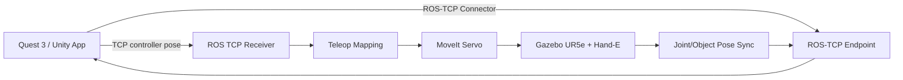

# UR5e Hand-E VR Teleoperation

This project lets a Meta Quest 3 user teleoperate a simulated UR5e robot with a Robotiq Hand-E gripper in Gazebo through a Unity MR/VR interface. Unity provides headset/controller input, robot visualization, synchronized object visualization, a floating control panel, and wrist-camera recording. ROS 2, MoveIt Servo, and Gazebo provide the robot control and physics authority.

## Demo Videos

Use this section for short demo links once the project has stable recordings. Prefer linking videos from GitHub Releases, YouTube, Google Drive, or lab storage instead of committing large `.mp4` files directly to the repository.

| Demo | Description | Link |
| --- | --- | --- |
| Full system bringup | Container start, Gazebo launch, Unity connection, and first robot motion. | TODO |
| Quest teleoperation | Headset/controller input moving the UR5e end effector. | TODO |
| Object manipulation | Robot moving the cubes/cylinders onto the target plates. | TODO |
| Wrist camera recording | Floating panel preview and saved wrist-camera data. | TODO |

## Main Docs

Start here:

- [docs/System_Setup.md](docs/System_Setup.md): full replication guide for a new computer or new developer.
- [docs/Getting_Started.md](docs/Getting_Started.md): day-to-day run guide, backend bringup, checkpoints, controller buttons, and recovery.
- [docs/Technical_Details.md](docs/Technical_Details.md): deeper architecture, networking, mapping, recording, troubleshooting, and Git/GitHub notes.

## System Diagram



## Current Status

The current canonical backend is:

```text
ros_backend1.0
```

The active Unity scene is:

```text
UnityApp/Assets/Scenes/Ur5e_Working 1.unity
```

Preferred local development mode is wired Quest TCP over USB with `adb reverse`.

## Tested Environment

| Component | Tested Version / Setup |
| --- | --- |
| Unity | `6000.2.10f1` |
| Headset | Meta Quest 3 |
| Unity app package ID | `com.noahli.handtrackingunity` |
| Backend | Dockerized ROS 2 Humble workspace |
| Robot | UR5e + Robotiq Hand-E |
| Simulation | Gazebo |
| Motion control | MoveIt Servo |
| Preferred connection | USB wired via `adb reverse` |

## Repository Layout

```text
.
├── README.md
├── docs/
│   ├── System_Setup.md
│   ├── Getting_Started.md
│   └── Technical_Details.md
├── dev_notes/
│   ├── README.md
│   └── Unity_Quest_Debug_Stream_Setup.md
├── UnityApp/
│   ├── Assets/
│   ├── Packages/
│   └── ProjectSettings/
└── ros_backend1.0/
    ├── Dockerfile
    ├── docker-compose.yaml
    ├── .env.example
    ├── scripts/
    ├── simulation/
    └── src/
```

## Quick Start

Clone with Git LFS:

```bash
git lfs install
git clone git@github.com:su-idr-lab/ros_unity_project.git
cd ros_unity_project
git lfs pull
```

Start the wired backend:

```bash
cd ros_backend1.0
cp .env.example .env
./scripts/backend10_lifecycle.sh bringup_wired
./scripts/backend10_lifecycle.sh status
```

Open Unity:

```text
Unity Hub -> Add project from disk -> UnityApp
Unity version: 6000.2.10f1
Active scene: Assets/Scenes/Ur5e_Working 1.unity
```

For complete setup, use [docs/System_Setup.md](docs/System_Setup.md). For normal operation, use [docs/Getting_Started.md](docs/Getting_Started.md).

## Developer Notes

Active implementation notes and debugging plans live in [dev_notes/](dev_notes/). These are developer-facing notes, while `docs/` is the stable user-facing documentation.

## Controls Summary

Right controller:

- `Grip hold`: engage robot teleop.
- `Trigger tap`: toggle gripper open / close.
- `A hold`: rotation mode.
- `B tap`: reset robot and table objects.
- `Thumbstick press`: clutch / pause hand following; release to reset hand reference.

Left controller:

- `X tap`: start / stop wrist-camera recording.
- `Y tap`: switch hand-pose mode and thumbstick/gamepad mode.

## Recording

Wrist-camera recordings are stored on Quest under:

```text
/storage/emulated/0/Android/data/com.noahli.handtrackingunity/files/GripperCameraRecordings
```

Do not commit recordings or videos to Git. Store demos externally and link them in the Demo Videos table.

## Known Limitations

- Gazebo rendering on macOS Docker can be CPU-heavy.
- Wired Quest mode requires `adb reverse` and an active USB connection.
- Unity is intended as visualization/control UI; Gazebo is the physics authority.
- Videos and datasets are intentionally not stored in Git.

## Development Workflow

Keep `main` stable. Use feature branches for changes:

```bash
git checkout -b feature/my-change
```

After testing:

```bash
git add UnityApp ros_backend1.0 docs README.md
git commit -m "Describe the change"
git push -u origin feature/my-change
```

Merge to `main` only after the Quest build and backend are tested.

## Versioning Recommendation

Going forward, prefer Git tags/releases instead of copying backend folders repeatedly:

```text
v1.0
v1.1
v1.2
```

For now, `ros_backend1.0/` remains the canonical backend folder to avoid breaking existing paths and scripts.
