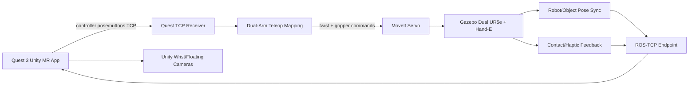

# ROS Unity MR Dual-Arm Teleoperation

This repository contains a Meta Quest 3 mixed-reality teleoperation platform for simulated robot manipulation. Unity provides the MR passthrough interface, controller input, robot/object visualization, movable workspace UI, central control panel, and camera recording. The Dockerized ROS 2 Humble backend provides Gazebo simulation, MoveIt Servo control, Robotiq Hand-E gripper control, task-object synchronization, reset logic, and haptic/contact feedback.

Gazebo is the physics authority. Unity is the headset-side control, visualization, and data-collection interface.

## System Overview

### Main Docs

- [docs/System_Setup.md](docs/System_Setup.md): full replication/setup guide for a new computer or new developer.
- [docs/Getting_Started.md](docs/Getting_Started.md): day-to-day run guide and operational checks.
- [docs/Technical_Details.md](docs/Technical_Details.md): architecture, networking, mapping, recording, troubleshooting, and robot/task adaptation details.
- [ros_backend1.1/Readme/DualArm_Getting_Started.md](ros_backend1.1/Readme/DualArm_Getting_Started.md): current dual-arm backend command sheet.
- [ros_backend1.1/Readme/Task_Profile_Workflow.md](ros_backend1.1/Readme/Task_Profile_Workflow.md): task/workspace/profile workflow.

### System Diagram


```mermaid
flowchart LR
    Quest[Quest 3 Unity MR App]
    Receiver[Quest TCP Receiver]
    Mapper[Dual-Arm Teleop Mapping]
    Servo[MoveIt Servo]
    Gazebo[Gazebo Dual UR5e + Hand-E]
    Sync[Robot/Object Pose Sync]
    RosTcp[ROS-TCP Endpoint]
    Haptics[Contact/Haptic Feedback]
    Recorder[Unity Wrist/Floating Cameras]

    Quest -->|controller pose/buttons TCP| Receiver
    Receiver --> Mapper
    Mapper -->|twist + gripper commands| Servo
    Servo --> Gazebo
    Gazebo --> Sync
    Sync --> RosTcp
    RosTcp --> Quest
    Gazebo --> Haptics
    Haptics --> RosTcp
    Quest --> Recorder
```

### Current Status

| Item | Current Project Default |
| --- | --- |
| Backend | `ros_backend1.1` |
| Docker container | `motion_planner_11` |
| Lifecycle script | `ros_backend1.1/scripts/backend11_lifecycle.sh` |
| Unity active scene | `UnityApp/Assets/Scenes/GazeboReplica_DualArm_MR.unity` |
| Single-arm backup scene | `UnityApp/Assets/Scenes/GazeboReplica_MR.unity` |
| Robot setup | Dual UR5e arms with Robotiq Hand-E grippers |
| Preferred connection | Wired Quest USB using `adb reverse` |
| Quest controller TCP | Quest `127.0.0.1:5026` -> host `127.0.0.1:5026` -> container `5005` |
| Unity ROS-TCP | Quest `127.0.0.1:10001` -> host `127.0.0.1:10001` -> container `10000` |

### Tested Environment

| Component | Tested Version / Setup |
| --- | --- |
| Unity | `6000.2.10f1` |
| Headset | Meta Quest 3 |
| Unity target | Android / Quest |
| Unity package ID | `com.noahli.ROSUNITY` |
| Backend | Dockerized ROS 2 workspace |
| ROS | Humble inside container |
| Simulation | Gazebo |
| Motion control | MoveIt Servo |
| Robot | Dual UR5e + Robotiq Hand-E |
| Host development | macOS with Docker Desktop |
| Preferred Quest link | USB wired mode via `adb reverse` |

### Repository Layout

```text
.
├── README.md
├── docs/
│   ├── System_Setup.md
│   ├── Getting_Started.md
│   └── Technical_Details.md
├── UnityApp/
│   ├── Assets/
│   ├── Packages/
│   └── ProjectSettings/
└── ros_backend1.1/
    ├── Dockerfile
    ├── docker-compose.yaml
    ├── .env.example
    ├── profiles/
    ├── scripts/
    ├── simulation/
    └── src/
```

Local recordings, APKs, generated Unity folders, ROS build folders, and private developer notes are intentionally ignored by Git.

## Quick Start

### 1. Clone And Restore Assets

```bash
git lfs install
git clone git@github.com:su-idr-lab/ros_unity_project.git
cd ros_unity_project
git lfs pull
```

### 2. Start The Dual-Arm Backend

```bash
cd ros_backend1.1
cp .env.example .env
./scripts/backend11_lifecycle.sh mode_wired
./scripts/backend11_lifecycle.sh bringup_dual
./scripts/backend11_lifecycle.sh status
```

`bringup_dual` starts the container, applies wired ADB reverse tunnels if the Quest is connected, generates the current dual-arm Gazebo world from profiles, starts Gazebo, starts MoveIt Servo, starts the Quest TCP receiver, starts the dual mapping/control pipeline, and starts Unity synchronization.

If Gazebo was closed but the container is still running:

```bash
cd ros_backend1.1
./scripts/backend11_lifecycle.sh start_dual_sim
sleep 2
./scripts/backend11_lifecycle.sh start_dual_servo
./scripts/backend11_lifecycle.sh start_dual_part23
./scripts/backend11_lifecycle.sh start_dual_part4
./scripts/backend11_lifecycle.sh status
```

For a clean restart:

```bash
cd ros_backend1.1
./scripts/backend11_lifecycle.sh safe_down
./scripts/backend11_lifecycle.sh bringup_dual
```

### 3. Install Or Run The Quest App

If a prebuilt APK exists locally, install it directly on the headset:

```bash
adb devices
adb install -r -d 'UnityApp/App_Build/R&U_1.0.5.apk'
```

If the APK name is different:

```bash
ls UnityApp/App_Build/*.apk
adb install -r -d '<path-to-apk>'
```

APKs are ignored by Git, so a fresh clone may need a Unity build first.

### 4. Open The Unity Project If Rebuilding

```text
Unity Hub -> Add project from disk -> UnityApp
Unity version: 6000.2.10f1
Active scene: Assets/Scenes/GazeboReplica_DualArm_MR.unity
```

In wired mode, the Unity app should use:

| Unity Setting | Value |
| --- | --- |
| Hand/controller TCP target IP | `127.0.0.1` |
| Hand/controller TCP target port | `5026` |
| ROS Settings IP Address | `127.0.0.1` |
| ROS Settings Port | `10001` |

Build and run the Android/Quest profile from Unity only if you are rebuilding instead of installing a prebuilt APK.

## Control Summary

The current app is built around independent dual-arm teleoperation. Each physical controller drives one robot arm by default.

### Right Controller / Right Arm

- `Grip hold`: engage right-arm teleop.
- `Trigger tap`: toggle right gripper open/close.
- `A hold`: right-arm rotation mode.
- `B tap`: toggle right-arm attachment mode.

### Left Controller / Left Arm

- `Grip hold`: engage left-arm teleop.
- `Trigger tap`: toggle left gripper open/close.
- `X hold`: left-arm rotation mode.
- `Y tap`: toggle left-arm attachment mode.

### Shared Controls And Panel Actions

- Central control panel buttons handle reset, status, camera view selection, recording, haptic settings, and task controls.
- `Swap Hands` on the control panel swaps which physical controller drives each robot arm.
- Workspace drag/rotation is available when teleop grip is not engaged.
- Attachment mode attempts to make the robot end effector follow the controller pose more directly in the MR workspace frame.
- The coupled Hand-E gripper controller is the default backend gripper mode for dual-arm bringup.
- The old in-headset hand-pose/thumbstick mode switch is disabled by default. Optional keyboard/thumbstick modes are terminal-driven right-arm overrides; see [docs/Getting_Started.md](docs/Getting_Started.md).

### Recording

Recording is controlled from the Unity side.

- Left controller `X` can start/stop wrist-camera recording when enabled in the Unity recorder script.
- The central control panel can start/stop recording and switch preview source.
- Current preview sources are left wrist camera, right wrist camera, and floating camera.
- The floating camera is for movable scene preview; wrist cameras are the main data-recording path.

Recordings on Quest are saved under:

```text
/storage/emulated/0/Android/data/com.noahli.ROSUNITY/files/GripperCameraRecordings
```

Pull recordings to the host with:

```bash
adb pull "/storage/emulated/0/Android/data/com.noahli.ROSUNITY/files/GripperCameraRecordings" ./GripperCameraRecordings
```

Do not commit recordings, APKs, or demo videos to Git. Upload final clips to GitHub Releases, YouTube, Google Drive, or lab storage, then link the hosted URLs in the demo section.

## Demo Media

This section should show Unity app features, not backend bringup. Backend startup is already covered in Quick Start.

Recommended format:

- Use the current v2 topic clips as the README upload set.
- Use muted MP4/H.264 for hosted clips.
- Use GIF only as a tiny fallback preview if needed.
- Keep raw Quest recordings outside Git.
- Public demo links are hosted as unlisted YouTube videos; raw recordings remain outside Git.


[Full demo video](https://youtu.be/xJCyWlMuZTQ)

| Feature | Preview | V2 Clip | What To Show | Hosted Video |
| --- | --- | --- | --- | --- |
| Project intro / MR workspace |  | `01_intro_Project_intro.mp4` | Quest passthrough with the simulated dual-arm workspace, task objects, and control panel placed in the room. | [Watch](https://youtu.be/5J4qUSEHJ8Q) |
| Central control panel |  | `02_control_panel_Central_control_panel_buttons.mp4` | Page switching, reset buttons, swap hands, camera controls, task controls, and debug controls. | [Watch](https://youtu.be/Pfm06HfjQYs) |
| Workspace drag/reset/rotation |  | `03_workspace_drag_Workspace_reset_drag_and_rotation.mp4` | Move and rotate the shared workspace while robot and task visuals stay grouped. | [Watch](https://youtu.be/7B3oCiTcR_Q) |
| Floating camera placement |  | `04_floating_camera_Floating_camera_placement_and_rotation.mp4` | Place the floating camera and adjust its rotation handles in MR. | [Watch](https://youtu.be/Oz-em5T_6e8) |
| Wrist camera recording |  | `05_wrist_camera_Wrist_camera_recording_and_capture.mp4` | Select wrist/floating camera views and start/stop recording or capture from the panel. | [Watch](https://youtu.be/D6pof3wCspg) |
| Attachment mode |  | `06_attachment_Attachment_mode_and_offset_calibration.mp4` | Align the controller and gripper using attachment mode and offset calibration. | [Watch](https://youtu.be/YCunphtiU4U) |
| Haptic feedback |  | `07_haptics_Haptic_feedback_modes.mp4` | Show haptic/contact feedback controls and feedback-mode behavior. | [Watch](https://youtu.be/SlRmVWTV-x4) |
| Task/debug pages |  | `08_task_page_Task_and_debug_pages.mp4` | Show task selection, status, and debug controls on the central panel. | [Watch](https://youtu.be/uySzKrMUrYk) |
| Pick/place task |  | `09_pick_place_Pick_and_place_task.mp4` | Pick and place task objects on target plates. | [Watch](https://youtu.be/3RRWzHUXET4) |
| Dual-arm handoff |  | `10_dual_handoff_Dual_arm_handoff.mp4` | Use both arms together for a coordinated handoff. | [Watch](https://youtu.be/W380J-VKKL8) |
| Cable task layout |  | `11_cable_intro_Cable_insertion_task_intro.mp4` | Introduce the cable rods, receiver boxes, and multiple port clearances. | [Watch](https://youtu.be/hWEKjaqdx6k) |
| Loose port insertion |  | `13_loose_ports_Loose_port_insertions.mp4` | Demonstrate easier cable insertion ports. | [Watch](https://youtu.be/Nkdtu-we2gI) |
| Tighter port insertion |  | `14_tighter_ports_Tighter_port_insertion_behavior.mp4` | Show insertion behavior as port tolerance becomes tighter. | [Watch](https://youtu.be/m0dovinv2Hs) |
| Fixed receiver box |  | `15_fixed_box_Fixed_insertion_box.mp4` | Demonstrate the fixed receiver-box insertion setup. | [Watch](https://youtu.be/mO-z67oC6no) |
| Tightest ports / conclusion |  | `16_tightest_ports_Tightest_ports_and_conclusion.mp4` | Show the most difficult port condition and closing demo frame. | [Watch](https://youtu.be/RCicppveXlI) |
| Control panel drag/resize |  | `17_control_panel_drag_resize_Control_panel_drag_and_resize.mp4` | Drag the central panel and resize it with the corner handles. | [Watch](https://youtu.be/g5qecVFjjOM) |

## Current Limitations

- The current setup is tuned for dual UR5e + Robotiq Hand-E in simulation; switching robot arms still requires coordinated backend profiles, MoveIt configuration, controller topics, Unity visualization, and mapping parameters.
- Gazebo is the physics authority; Unity should not be used as a competing physics simulation for synchronized objects.
- macOS Docker/Gazebo rendering can be CPU-heavy and may not use GPU acceleration like a native Linux workstation.
- Wired Quest mode is the recommended path, but it requires USB connection, ADB authorization, and working `adb reverse` tunnels.
- Runtime task switching is still evolving. The profile system exists, but polished end-user task switching should eventually be handled by a robust ROS task manager and Unity task-selection UI.
- Haptic feedback should stay contact-driven. EE-error vibration can be useful for debugging but can be misleading during normal fast motion.
- Demo clips, recordings, datasets, APKs, Unity generated folders, and ROS build artifacts are intentionally not stored in Git.
- License is not finalized yet. MIT is a good candidate if the lab/advisor wants broad reuse, but this should be confirmed before adding a `LICENSE` file because license choice affects legal reuse rights.
