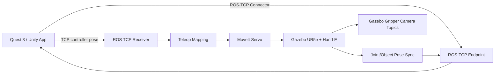

# System Setup

This document is the replication guide for the UR5e Hand-E VR teleoperation project. It explains what the system does, what hardware/software is required, how the repository is organized, and how a new developer can rebuild the Unity Quest app and ROS/Gazebo backend.

## Project Goal

This project lets a Meta Quest 3 user teleoperate a simulated UR5e robot with a Robotiq Hand-E gripper in Gazebo through a Unity MR/VR interface. Unity provides headset/controller input, robot visualization, synchronized object visualization, a floating control panel, and wrist-camera recording. ROS 2, MoveIt Servo, and Gazebo provide the robot control and physics authority.

## Demo Videos

Use this table for short demo links. Prefer GitHub Releases, YouTube, Google Drive, or lab storage instead of committing `.mp4` files directly.

| Demo | Description | Link |
| --- | --- | --- |
| Full system bringup | Container start, Gazebo launch, Unity connection, and first robot motion. | TODO |
| Quest teleoperation | Headset/controller input moving the UR5e end effector. | TODO |
| Object manipulation | Robot moving cubes/cylinders onto target plates. | TODO |
| Wrist camera recording | Floating panel preview and saved wrist-camera data. | TODO |

## System Diagram



## Current Status

The current canonical backend is:

```text
ros_backend1.0
```

The active Unity scene is:

```text
UnityApp/Assets/Scenes/Ur5e_Working 1.unity
```

The preferred development connection mode is wired Quest mode over USB using `adb reverse`.

## Tested Environment

| Component | Tested Version / Setup |
| --- | --- |
| Unity | `6000.2.10f1` |
| Headset | Meta Quest 3 |
| Unity target platform | Android / Quest |
| Unity app package ID | `com.noahli.handtrackingunity` |
| Backend | Dockerized ROS 2 workspace |
| ROS | Humble inside container |
| Robot | UR5e + Robotiq Hand-E |
| Simulation | Gazebo |
| Motion control | MoveIt Servo |
| Host development | macOS with Docker Desktop |
| Preferred Quest connection | USB wired via `adb reverse` |

## Repository Layout

```text
.
├── README.md
├── docs/
│   ├── System_Setup.md
│   ├── Getting_Started.md
│   └── Technical_Details.md
├── UnityApp/
│   ├── Assets/
│   ├── Packages/
│   └── ProjectSettings/
└── ros_backend1.0/
    ├── Dockerfile
    ├── docker-compose.yaml
    ├── .env.example
    ├── scripts/
    ├── simulation/
    └── src/
```

## Repository Size And Git LFS

The local `UnityApp/` folder can become several GB after Unity opens it because Unity generates `Library/`, `Temp/`, logs, and local build outputs.

The pushed/tracked Unity content is much smaller:

```text
Tracked UnityApp files: about 94 MB
UnityApp Git LFS files: about 91 MB
```

This repository uses Git LFS for large Unity/robot assets. After cloning, always run:

```bash
git lfs pull
```

Do not commit generated folders or data outputs:

```text
UnityApp/Library/
UnityApp/Temp/
UnityApp/Build/
UnityApp/Builds/
UnityApp/BuildTest/
ros_backend1.0/build/
ros_backend1.0/install/
ros_backend1.0/log/
recordings/
GripperCameraRecordings/
*.apk
*.mp4
*.mov
```

## Hardware Requirements

Required:

- Meta Quest 3.
- USB-C data cable.
- Host computer capable of running Docker.
- Unity Editor with Android build support.
- Internet access for first clone/package restore.

Optional:

- Quest casting or screen recording for demos/debugging.
- External display for Gazebo/noVNC monitoring.
- Lab storage for datasets/videos.

## Software Requirements

- Git.
- Git LFS.
- Unity Hub.
- Unity `6000.2.10f1`.
- Unity Android Build Support.
- Unity Android SDK & NDK Tools.
- Unity OpenJDK.
- Docker Desktop on macOS or Docker Engine / Docker Compose on Linux.
- `adb` for Quest wired mode.

## Clone And Restore Assets

```bash
git lfs install
git clone git@github.com:su-idr-lab/ros_unity_project.git
cd ros_unity_project
git lfs pull
```

If Git LFS is skipped, robot meshes/textures may import incorrectly in Unity.

## Unity Quest Rebuild

1. Open Unity Hub.
2. Add project from disk:

```text
ros_unity_project/UnityApp
```

3. Open with Unity `6000.2.10f1`.
4. Let Unity restore packages and regenerate `Library/`.
5. Confirm active scene:

```text
Assets/Scenes/Ur5e_Working 1.unity
```

6. Confirm Quest build profile:

```text
Assets/Settings/Build Profiles/Quest3_4.2.asset
```

7. Connect Quest 3 by USB and accept the USB debugging prompt.
8. Check the device:

```bash
adb devices
```

9. In Unity, use `File > Build Profiles`, select Android/Quest, then `Build And Run`.

## Backend Setup

From the repository root:

```bash
cd ros_backend1.0
cp .env.example .env
./scripts/backend10_lifecycle.sh up_container
./scripts/backend10_lifecycle.sh build_ws
```

For normal wired development:

```bash
./scripts/backend10_lifecycle.sh bringup_wired
./scripts/backend10_lifecycle.sh status
```

## Expected Working Behavior

When the system is healthy:

- Gazebo shows the UR5e + Robotiq Hand-E gripper and tabletop objects.
- Quest app connects through `127.0.0.1` wired mode.
- Holding right grip engages robot teleop.
- Right trigger toggles gripper open/close.
- `B` resets robot and table objects.
- Unity robot visualization follows Gazebo joint states.
- Synchronized Unity objects follow Gazebo object poses.
- Wrist camera preview appears in the floating panel.
- Left `X` starts/stops wrist-camera recording.

## Main Controls

Right controller:

- `Grip hold`: engage robot teleop.
- `Trigger tap`: toggle gripper open / close.
- `A hold`: rotation mode for hand-pose control.
- `B tap`: reset robot and table objects.
- `Thumbstick press`: clutch / pause hand following; release to reset hand reference.

Left controller:

- `X tap`: start / stop wrist-camera recording.
- `Y tap`: switch hand-pose mode and thumbstick/gamepad mode.

Thumbstick/gamepad mode:

- `Left stick Y`: forward / back.
- `Left stick X`: left / right.
- `Left trigger`: move up.
- `Left grip`: move down.
- `Right stick Y`: rotate around robot angular Y.
- `Right stick X`: rotate around robot angular Z.

Floating panel:

- Release right grip so teleop is not engaged.
- Point left controller at the floating panel.
- Hold left trigger and move the controller to drag the panel.
- Release left trigger to drop the panel.

## Recording And Data Collection

Wrist-camera recordings are stored on Quest under:

```text
/storage/emulated/0/Android/data/com.noahli.handtrackingunity/files/GripperCameraRecordings
```

Pull recordings to the host:

```bash
adb pull "/storage/emulated/0/Android/data/com.noahli.handtrackingunity/files/GripperCameraRecordings" ./GripperCameraRecordings
```

Do not commit recordings or videos to Git. Put demos in GitHub Releases, YouTube, Google Drive, or lab storage and link them from the README.

## Troubleshooting Top Checks

- Missing Unity meshes/textures: run `git lfs pull`.
- Quest not visible: run `adb devices` and accept the headset USB debugging prompt.
- Wired mode not connecting: rerun `./scripts/backend10_lifecycle.sh wired_on`.
- Robot does not move: run `./scripts/backend10_lifecycle.sh status`.
- Unity receives no sync: confirm Part 4 is running.
- Gripper visual jitters: confirm Unity gripper is visual-only and not physics-driven.
- Recording path is empty: confirm package ID is `com.noahli.handtrackingunity`.

## Known Limitations

- Gazebo rendering on macOS Docker can be CPU-heavy.
- Wired Quest mode requires `adb reverse` and an active USB connection.
- Unity is intended as visualization/control UI; Gazebo is the physics authority.
- Videos and datasets are intentionally not stored in Git.
- Some runtime Quest bugs still require `adb logcat` or headset video to debug effectively.

## Development Workflow

Keep `main` stable and use branches for changes:

```bash
git checkout -b feature/my-change
```

After testing:

```bash
git add UnityApp ros_backend1.0 docs README.md
git commit -m "Describe the change"
git push -u origin feature/my-change
```

Merge to `main` only after the Quest build and backend are tested.

Useful branch names:

```text
feature/runtime-debug-panel
feature/input-record-replay
feature/wrist-camera-panel
bugfix/y-button-mode
bugfix/gripper-visual-sync
```

## License And Credits

Add a root `LICENSE` before wider reuse. Recommended options for this robotics project are BSD-3-Clause or Apache-2.0.

Third-party components and licenses are retained in their source folders where available, including ROS-TCP Endpoint, UR description/config assets, Robotiq Hand-E assets, Unity packages, ROS 2, MoveIt, and Gazebo-related components.
